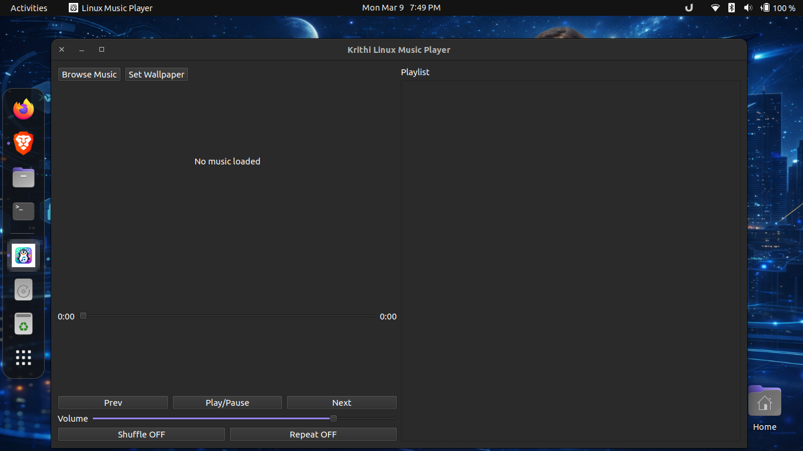
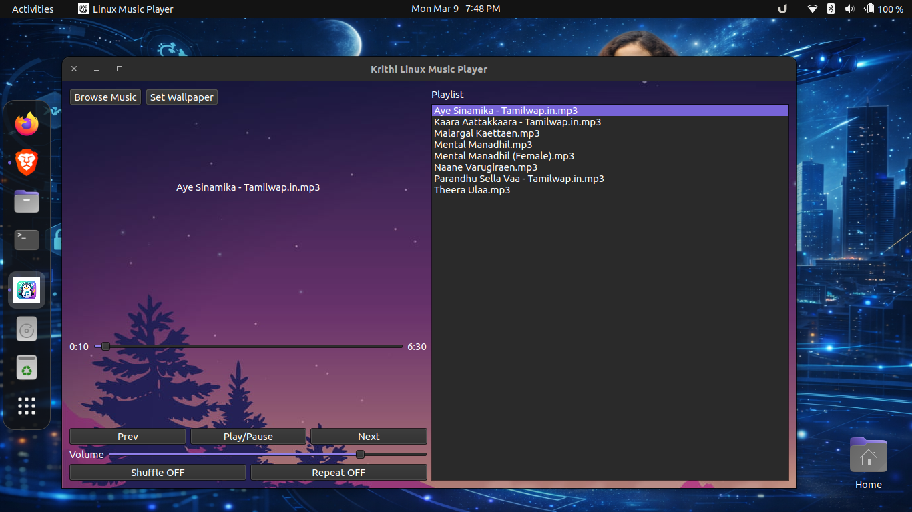

# Linux Music Player (Python + VLC)

A lightweight and simple music player for Linux built using **Python**, **PyQt6**, and the **VLC backend**.

This project was created as a personal learning experiment to understand how a desktop media player works internally. The goal was to build a **clean, lightweight, and easy-to-use music player** that can play audio files from the local system with a minimal and modern interface.

---






---

## Project Idea

The idea behind this project was simple.

Instead of using heavy music players, I wanted to build my own **lightweight Linux music player** that focuses only on the core features of a music player.

The goal was to create something simple, responsive, and easy to use while also learning how **desktop GUI applications are built in Python**.

This project helped me explore how Python can be used to build **desktop applications for Linux systems**.

---

## How This Project Was Built

This music player was built using **Python and PyQt6** for the graphical user interface.

For audio playback I used the **VLC media engine through python-vlc**, because VLC supports many different audio formats.

The development process included the following steps:

* Designing a basic user interface using PyQt6
* Adding a **Browse Music button** to select audio files
* Creating a **queue system** to play multiple songs
* Integrating the **VLC backend** for media playback
* Implementing a **timeline slider** to display playback progress
* Adding playback controls such as **Play, Pause, Next and Previous**
* Implementing **keyboard shortcuts**
* Adding a feature to **set an image as the player background**

The main focus of this project was **simplicity and learning**.

---

## Features

* Browse and load music from local folders
* Supports multiple audio formats (MP3, WAV, FLAC, AAC, ALAC, WMA, MIDI and more)
* Queue based playback
* Play / Pause button
* Next and Previous track controls
* Timeline slider showing song progress
* Current playback time and total duration
* Keyboard shortcuts
* Custom background image (player skin)
* Playlist sidebar showing the song queue
* Current playing track highlighted in playlist
* Volume control slider
* Shuffle playback mode
* Repeat playlist mode
* Drag and drop music files directly into the player

The player remains **lightweight and minimal** while offering useful modern playback features.

---

## Keyboard Shortcuts

| Shortcut | Action           |
| -------- | ---------------- |
| Ctrl + O | Open music files |
| Spacebar | Play / Pause     |

---

# Technologies Used

* Python 3
* PyQt6 (GUI framework)
* python-vlc (audio playback library)
* VLC Media Player backend

---

## Required Libraries

Install dependencies before running the player.

```
sudo apt install vlc
pip3 install PyQt6 python-vlc
```

---

## Run From Source

Clone the repository:

```
git clone https://github.com/ankur-saxena-88/linux-music-player.git
```

Go to the project directory:

```
cd linux-music-player
```

Run the program:

```
python3 linux_mplayer_v1o1.py
```

---

## Download Prebuilt Installer (.deb)

If you prefer installing the player using a Debian package, you can download the installer below.

**Download the latest `.deb` package**

```
Download Linux Music Player .deb
```

Example installation:

```
sudo dpkg -i linux-music-player_1.1.deb
```

Run the player:

```
linux-mplayer
```

Or open it from the **application menu**.

---

## Important Note for Developers and Testers

When packaging Python applications for Linux, the script must include a **Python shebang line** at the top of the file.

```
#!/usr/bin/env python3
```

Without this line the system may try to run the script using the shell instead of Python.

This can produce errors such as:

```
import: command not found
syntax error near unexpected token
```

Always ensure the executable script begins with:

```
#!/usr/bin/env python3
```

---

## Future Improvements

Possible improvements for future versions include:

* Album artwork support
* Audio equalizer
* Folder import support
* Playlist saving
* Mini player mode
* Modern UI themes

---

## Author

**Ankur Saxena**

A technology enthusiast who enjoys experimenting with Linux, programming, and building practical software tools for learning and research.

---

# License

This project is open source and available for **learning and educational purposes**.
